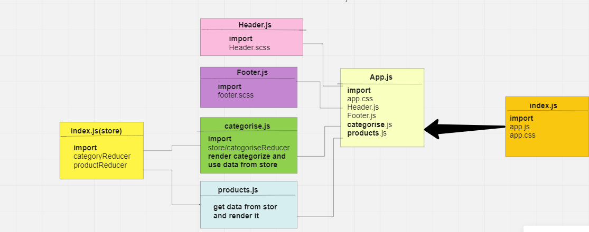

# storefront

## [AppLink](https://storefront-eight-sand.vercel.app/)
## Description
create an e-Commerce storefront using React with Redux, coupled with live API server.
## Features
an App component that serves as the container for all sub-components of this application
a component which shows the name of your virtual store
a component which shows your copyright and contact information a component shows a list of all categories
dispatches an action when one is clicked to “activate” it a component
displays a list of products associated with the selected category
## Phase 1 Requirements
- As a user, I expect to see a list of available product categories in the store so that I can easily browse products
- As a user, I want to choose a category and see a list of all available products matching that category
- As a user, I want a clean, easy to use user interface so that I can shop the online store with confidence
## Phase 2 Requirements

- As a user, I want to choose from products in the list and add them to my shopping cart
- As a user, I want to see the products that I've added to my shopping cart so that
- As a user, I want to change the quantity of items I intend to purchase in my shopping cart
- As a user, I want to be able to remove an item from my shopping cart
## Phase 3 Requirements

In phase 3, we will be connecting our Virtual Store to a live API so that our data is persistent and able to be separately managed.
- As a user, I want to interact with live inventory so that I have confidence that the displayed products are in stock
- As a user, I want to know to that when I add an item to my cart, that it is removed from inventory so that no other users can purchase it

##  phase 4 Requirements
 we will be completing work on our Virtual Store by adding a two full page views to the application: Product Details and Checkout
 - As a user, I want to see a full detail view of a product so that I can make a more informed choice about purchasing it.
- As a user, I want to view my full cart and initiate the checkout process so that I can purchase my items and have them delivered
## UML

